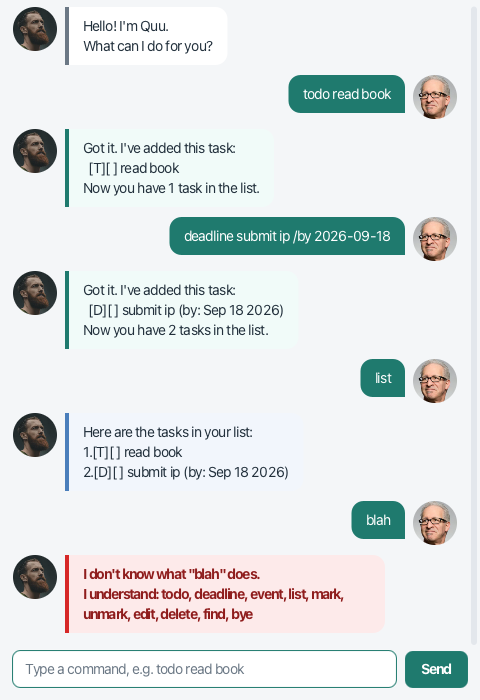

# Quu User Guide



**Quu** is a desktop chatbot that keeps track of your tasks. You talk to it by typing,
the way you would message a friend, and it answers in a chat window. It remembers your
tasks between sessions, so you can close it and pick up where you left off.

Quu is built for people who type faster than they click.

## Quick start

1. Make sure you have **Java 25** or later installed.
2. Download the latest `Quu.jar` from the [releases page](https://github.com/Cookiemunchrr/ip/releases).
3. Put the file in the folder you want Quu to work from. Quu saves your tasks to a
   `data` folder next to the jar.
4. Open a terminal in that folder and run:

   ```
   java -jar Quu.jar
   ```

5. Type a command into the box at the bottom and press **Enter**. Try `todo read book`.

## Things worth knowing

- **Words in angle brackets are yours to fill in.** In `todo <task>`, replace `<task>`
  with what you actually want to do, as in `todo read book`.
- **Anything in square brackets is optional.** In
  `edit <task number> [<new description>] [/<detail> <value>]` you can give a new
  description, a detail, or both.
- **Capitals don't matter for commands.** `todo`, `Todo` and `TODO` all work. What you
  type *after* the command is kept exactly as you wrote it, so `todo Read Book` keeps its
  capitals.
- **Dates are always `yyyy-mm-dd`**, for example `2026-09-18`. Quu shows them back to you
  in a friendlier form, like `Sep 18 2026`.
- **Task numbers come from `list`.** They start at 1 and shift when you delete something,
  so it is worth running `list` before deleting or marking by number.
- **Your tasks save themselves** after every command that changes something. There is no
  save command.

## Features

### Adding a task with no date: `todo`

Adds something you need to do, with no deadline attached.

Format: `todo <task>`

Example: `todo read book`

```
Got it. I've added this task:
  [T][ ] read book
Now you have 1 task in the list.
```

### Adding a task with a due date: `deadline`

Adds something due by a particular date.

Format: `deadline <task> /by <yyyy-mm-dd>`

Example: `deadline submit ip /by 2026-09-18`

```
Got it. I've added this task:
  [D][ ] submit ip (by: Sep 18 2026)
Now you have 2 tasks in the list.
```

### Adding something that spans dates: `event`

Adds something that runs from one date to another. The end date cannot fall before the
start date.

Format: `event <task> /from <yyyy-mm-dd> /to <yyyy-mm-dd>`

Example: `event orientation /from 2026-08-01 /to 2026-08-03`

```
Got it. I've added this task:
  [E][ ] orientation (from: Aug 1 2026 to: Aug 3 2026)
Now you have 3 tasks in the list.
```

### Seeing everything: `list`

Shows every task, numbered. `[T]`, `[D]` and `[E]` tell you the kind of task, and `[X]`
marks one you have finished.

Format: `list`

```
Here are the tasks in your list:
1.[T][ ] read book
2.[D][ ] submit ip (by: Sep 18 2026)
3.[E][ ] orientation (from: Aug 1 2026 to: Aug 3 2026)
```

If you have not added anything yet, Quu says so rather than showing an empty list.

### Marking a task done or not done: `mark`, `unmark`

Format: `mark <task number>` and `unmark <task number>`

Example: `mark 1`

```
Nice! I've marked this task as done:
 [T][X] read book
```

Example: `unmark 1`

```
OK, I've marked this task as not done yet:
 [T][ ] read book
```

### Changing a task: `edit`

Changes the details of a task you already added, without moving it in the list. You can
change the description, one of its dates, or both at once, and anything you leave out
stays as it was.

Format: `edit <task number> [<new description>] [/<detail> <value>]`

The details a task accepts depend on what kind of task it is:

| Task | Details you can edit |
|---|---|
| `[T]` to-do | description only |
| `[D]` deadline | description, `/by` |
| `[E]` event | description, `/from`, `/to` |

Example, changing the description: `edit 1 borrow book`

```
Got it. I've updated this task:
 [T][ ] borrow book
```

Example, changing a due date and leaving the description alone: `edit 2 /by 2026-09-19`

```
Got it. I've updated this task:
 [D][ ] submit ip (by: Sep 19 2026)
```

If you name a detail the task does not have, such as `/by` on a to-do, Quu tells you so
and leaves the task untouched.

### Searching: `find`

Shows every task whose description contains the word you give. Capitals are ignored, so
`find BOOK` finds `read book`.

Format: `find <keyword>`

Example: `find book`

```
Here are the matching tasks in your list:
1.[T][ ] read book
```

If nothing matches, Quu says so.

### Removing a task: `delete`

Format: `delete <task number>`

Example: `delete 3`

```
Noted. I've removed this task:
 [E][ ] orientation (from: Aug 1 2026 to: Aug 3 2026)
Now you have 2 tasks in the list.
```

### Leaving: `bye`

Says goodbye and closes the window. Your tasks are already saved.

Format: `bye`

```
Bye. Hope to see you again soon!
```

## When something goes wrong

Quu tries to tell you what to type instead of simply refusing.

| What you typed | What Quu says |
|---|---|
| `lst` | `I don't know what "lst" does.` followed by the list of commands it understands |
| `todo` | `Invalid format. Please follow this format: todo <task>` |
| `deadline submit ip /by tuesday` | `'tuesday' is not a valid date. Use yyyy-mm-dd, e.g. 2026-06-06.` |
| `mark 99` with 2 tasks | `There's no task 99. Your list has 2 tasks, numbered 1 to 2.` |
| `edit 1 /by 2026-01-01` on a to-do | `This task has no /by. Use: edit <task number> <task>` |
| `bye now` | `bye takes no arguments. Just type: bye` |

Errors appear in a red-edged bubble so they are easy to pick out of the conversation.

## Where your tasks are kept

Quu saves to `data/Quu.txt`, in the folder you ran it from. The file is plain text, one
task per line, so you can read it.

If Quu cannot understand a line when it next starts, it tells you which line is at fault,
renames the file to `data/Quu.txt.corrupted`, and begins with an empty list. Your original
file is left exactly as it was, so you can repair it and copy the good lines back. A
backup is never overwritten by a later one: Quu numbers them instead.

If the file is missing, Quu simply creates it the first time you add a task.

## FAQ

**How do I move my tasks to another computer?**
Copy `data/Quu.txt` into a `data` folder next to `Quu.jar` on the other computer. Quu
reads it the next time it starts.

**Can I edit the save file by hand?**
You can, it is plain text. If you get a line wrong, Quu will not lose your work: it moves
the file aside instead of overwriting it. See below.

## Command summary

| Command | Format |
|---|---|
| Add a to-do | `todo <task>` |
| Add a deadline | `deadline <task> /by <yyyy-mm-dd>` |
| Add an event | `event <task> /from <yyyy-mm-dd> /to <yyyy-mm-dd>` |
| List everything | `list` |
| Mark done | `mark <task number>` |
| Mark not done | `unmark <task number>` |
| Edit a task | `edit <task number> [<new description>] [/<detail> <value>]` |
| Find by keyword | `find <keyword>` |
| Delete a task | `delete <task number>` |
| Exit | `bye` |
